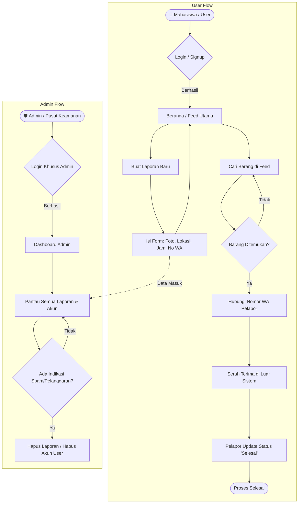

```mermaid
flowchart TD
    %% Definisi Aktor
    User([👤 Mahasiswa / User])
    Admin([🛡️ Admin / Pusat Keamanan])

    %% Alur Mahasiswa (User)
    subgraph User Flow
        User --> AuthU{Login / Signup}
        AuthU -->|Berhasil| Feed[Beranda / Feed Utama]
        
        %% Cabang 1: Mencari Barang
        Feed --> Cari[Cari Barang di Feed]
        Cari --> Cocok{Barang Ditemukan?}
        Cocok -->|Ya| WA[Hubungi Nomor WA Pelapor]
        WA --> COD[Serah Terima di Luar Sistem]
        COD --> Update[Pelapor Update Status 'Selesai']
        Update --> EndU([Proses Selesai])
        Cocok -->|Tidak| Cari
        
        %% Cabang 2: Membuat Laporan
        Feed --> Lapor[Buat Laporan Baru]
        Lapor --> Form[Isi Form: Foto, Lokasi, Jam, No WA]
        Form --> Feed
    end

    %% Alur Admin (Moderator)
    subgraph Admin Flow
        Admin --> AuthA{Login Khusus Admin}
        AuthA -->|Berhasil| DashA[Dashboard Admin]
        
        DashA --> Pantau[Pantau Semua Laporan & Akun]
        Pantau --> Validasi{Ada Indikasi Spam/Pelanggaran?}
        
        Validasi -->|Ya| Aksi[Hapus Laporan / Hapus Akun User]
        Validasi -->|Tidak| Pantau
    end

    %% Garis Relasi Sistem
    Form -.->|Data Masuk| Pantau
```
